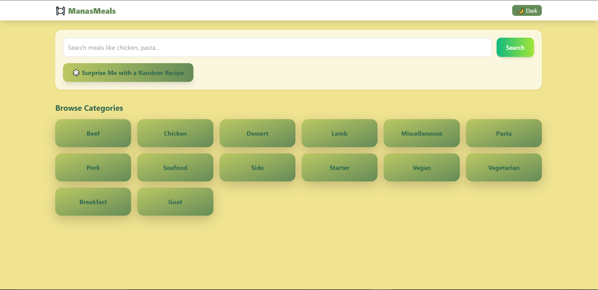
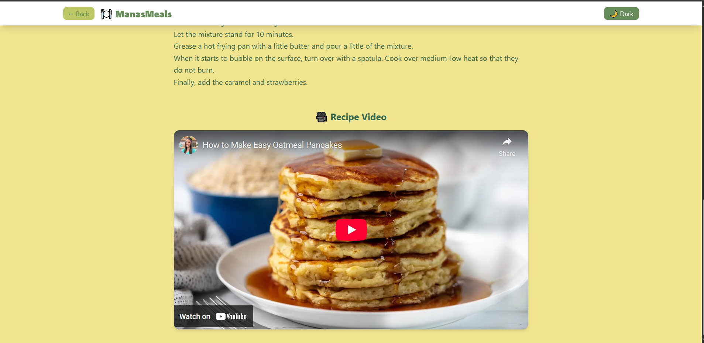
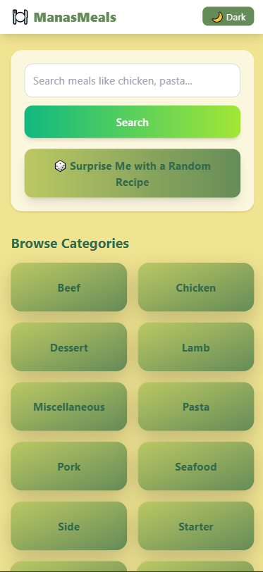
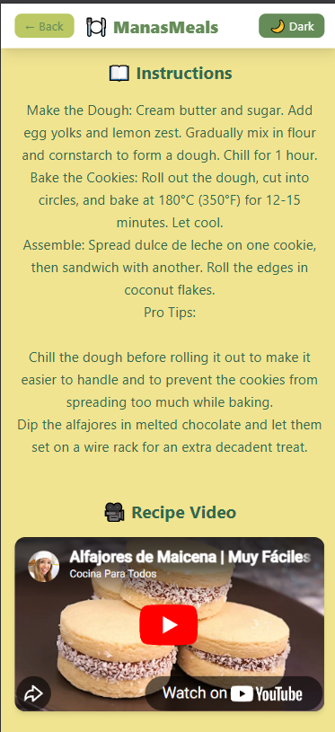

⚠️ Important Note (Please Read)

The backend is hosted on Render (Free Tier).
If the backend has been inactive, the first API request may take ~30–60 seconds to respond due to cold start.
After that, the app works normally and smoothly.

This is expected behavior for free hosting and not a performance issue in the application itself.

🌐 Live Demo

Frontend:
👉 https://meals-frontend-tawny.vercel.app/

Backend API:
👉 https://manasmeals-backend.onrender.com

📸 Screenshots
🖥️ Desktop Views
🏠 Home Page

🧭 Browse Categories

🍽️ Meal Cards

🧂 Ingredients & Instructions

🎥 YouTube Recipe Video

📱 Mobile Views
🏠 Mobile Home

🍽️ Mobile Meal Card

🎥 Mobile YouTube Video

### 📱 Mobile Views

  
  
  

Example API:

GET /api/meals/categories
GET /api/meals/search?name=chicken
GET /api/meals/random
GET /api/meals/{id}

🚀 Features

🍔 Recipe Discovery

Search meals by name

Browse meals by category

Fetch random recipes (“Surprise Me”)

📄 Meal Details Page

Large optimized meal image

Ingredients grid with icons & measurements

Step-by-step cooking instructions

Embedded YouTube recipe video

Responsive layout for mobile & desktop

❤️ Favorites

Save / remove favorite meals

Stored in browser localStorage

Persistent across sessions

🎨 UI / UX

Modern, clean design

Mobile-first & fully responsive

Light / Dark theme support

Skeleton loaders for better perceived performance

Empty states with friendly user messaging

🧱 Architecture Overview
React (Vite)
   |
   |  REST APIs
   ↓
Spring Boot Backend
   |
   ↓
TheMealDB Public API

Frontend and backend are fully decoupled

Environment-based configuration for API URLs

Production-grade REST patterns

🛠️ Tech Stack

Frontend

React (Vite)

JavaScript (ES6+)

Tailwind CSS

React Router

LocalStorage (Favorites)

Vercel (Hosting)

Backend

Java 21

Spring Boot

Spring Web (REST APIs)

Global Exception Handling

In-memory caching

Docker (multi-stage build)

Render (Hosting)

External API

TheMealDB API
https://www.themealdb.com/api.php

(Test API Key: 1)

⚡ Performance & Best Practices

Environment variable based configuration (VITE_API_BASE_URL)

Backend response caching to reduce API latency

Graceful error handling with meaningful API responses

Skeleton loaders instead of blocking spinners

Lazy backend cold start handled gracefully in UI

📦 Running Locally
Backend
cd backend
mvn spring-boot:run

Backend runs at:

http://localhost:8080

Frontend
cd frontend
npm install
npm run dev

Create .env in frontend/:

VITE_API_BASE_URL=http://localhost:8080

Frontend runs at:

http://localhost:5173

🐳 Backend Deployment (Docker)

The backend is deployed using a multi-stage Docker build:
Maven build stage
Lightweight Java 21 runtime
Compatible with platforms without native Java support

📝 Design & UX Decisions

Stacked layout for meal details for better readability across varying ingredient/instruction lengths
Avoided fragile side-by-side ingredient layouts
Environment-based API switching (local vs production)
API-only backend (no frontend assets served from backend)

👤 Author

Manas Saini

Software Engineer / Backend-Focused Full-Stack Developer
